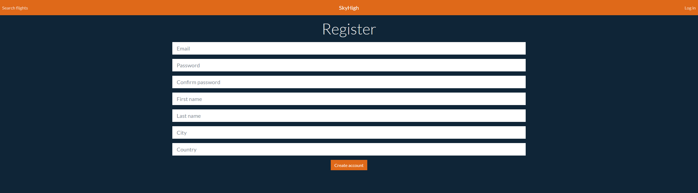
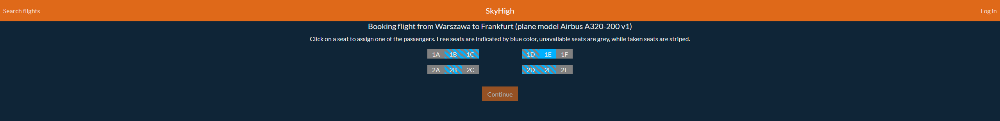

# SkyHigh
Flight ticket booking system created with React.js, Spring Boot and PostgreSQL

## Table of Contents
* [General Info](#general-info)
* [Technologies Used](#technologies-used)
* [Setup Guide](#setup-guide)
* [Usage](#usage)
* [Project Status](#project-status)
* [Room for Improvement](#room-for-improvement)

## General Info

SkyHigh is a web application implementing the backend part of an airline management system responsible for accepting reservations from customers. The application also has a simple Bootstrap-based interface based on the React.js framework. Basic use cases involve booking a flight for a specified group of people (differentiating between adults and children, for the purpose of ticket price differences), browsing the list of available and booked flights, confirming or cancelling a flight (including all pending tickets) and sending an email 30 minutes before departure, containing a link to confirm the flight.

## Technologies Used

SkyHigh was developed using Spring Boot 2.7.17 and React 18.2.0 and is designed to work with PostgreSQL 16 databases, and the complete configuration is available as a Docker Compose project. The user, however, can connect their own PostgreSQL database located on the same host. More details are explained in the section [Setup Guide](#setup-guide).

The application also uses a Google library called libphonenumber. Its purpose is to validate phone numbers with options for many locales.

## Setup Guide

First, clone this repository to a directory of your choice. In order to run the application, you must configure a PostgreSQL database and an email account to send mail from.

### Database

To configure the database, you must first create a password. This can be done by simply creating an environmental variable called `SKYHIGH_DB_PASSWORD`, which specifies the password to the database.

If you do not wish to install PostgreSQL yourself, you can use the complete Docker Compose configuration, which is further explained in the [Starting the App](#starting-the-app) section. 

### Email Account

It is suggested that you create your own email address specifically for use with the application. However, some providers, like Gmail, require you to enable two-factor authentication and to set up an application password. After creating the account, create two environmental variables:

- `SKYHIGH_EMAIL`, containing the email address
- `SKYHIGH_PASSWORD`, containing the email password or the application password associated with the email account

If not using an IDE, make sure to set up the `JAVA_HOME` environmental variable to point to the location of your JDK. The app is designed for Java 11.

### Starting the App

After configuring both services and setting up all three environmental variables, you can run the project by installing [Docker Desktop](https://www.docker.com) and running the following command in the project working directory:

`docker-compose up --build --force-recreate`

This command will create two Docker containers, one for handling the database and one for handling the main application. If successful, you can access the application with the following URL:

`http://localhost`

Additionally, the API documentation using Swagger UI is available at URL:

`http://localhost/swagger-ui.html`

Remember **not** to delete the containers or rerun the Docker Compose command above unless you want to entirely reinstall the application. These actions will cause loss of all data in the database, so in order to restart the application after being shut down, use the Docker Desktop app to stop and rerun the existing container.

As the app is not a complete and enterprise-level system and contains only the customer-side logic, initial population of the database is required. The main assumptions are:

- The `plane` table contains data on a single plane from an airline fleet. Each plane has a `plane_model` consisting of a manufacturer name (eg. Airbus), a family name (eg. A320), a model number (eg. 200) and the version number (eg. 1). This way, we can create the full plane name, eg. Airbus A320-200 v1. Planes are identified by their registration ID, typically consisting of five characters separated by a dash, according to pattern `ABC-DE`. A plane is also characterized by its `seat_config` - this trait consists of the row configuration (groups of seats separated by dashes that represent aisles, eg. 3-3 or 3-2-3) and number of rows. These two traits allow to calculate the total number of seats on a plane.
- For each `plane` record there should be `n` `seat` records, where `n` is the total number of seats on the plane. Each record should represent a different seat in the grid, resulting in a Cartesian product of row numbers and seat letters. This is a very important assumption, as deviating from it causes the application to behave unexpectedly (the potential to enforce this rule is present when the airline administration side of the application is developed).
- The `airport` table contains various airports identified by their IATA (International Air Transport Association) code, and are located in a certain city.
- The `flight` table contains scheduled flights - their departing airport and date, arrival airport and date, ticket prices for adults and children, and the `plane` instance that will be used to carry the passengers.
- The `seat_class` table defines several IATA-established fare classes: the economy class, the economy plus class, the business class and the first class. The classes are tied to seats by the `seat_class_ranges` table, which specifies the row ranges that define a section of the plane reserved for a specific fare class (eg. rows 1-10 contain first class seats, while rows 11-30 contain business class seats). The ranges, in a single plane, are assumed not to overlap each other, nor leave any empty rows with no business class assigned.

The database is automatically populated with one plane, four seat classes, several airports and a set of flights on first startup should you choose to run the project with an IDE or use the Docker Compose config.

## Usage

After accessing the URL `http://localhost`, you will be met with the following screen:

If you would like to book a flight, create an account first, by clicking on the link in the top right, then on the link below the form. Then, enter your email address, password, first name, last name, city and country.

After that, login to your account and return to the first page.

The city list may vary depending on your database data. Fill the form with your chosen source and destination (or click on their names on the list), number of adults and children, your preferred flight price range (including tickets for all passengers) and your preferred departure period. After clicking the button, the list of matching flights will appear:

 

Selecting a flight will bring up the seat map:

Clicking on a blue, non-striped square will bring up a popup prompting you to choose the person you want to assign the seat to. After choosing a seat for everyone, fill up the forms for every person (the first adult is considered the main person making the reservation, so that person is required to provide more contact details, such as a phone number).

After filling up the form, a green alert at the bottom right of the screen will indicate that the flight was successfully booked, and you will receive a confirmation email. If you cannot find the email, try looking for it in your spam folder.

You can also browse all your flights, confirm and cancel them, and modify them. For these options, click on your name on the top bar.

## Project Status

This project is currently a prototype of a customer-side airline system. It is not meant to be used commercially, but rather as a sample full-stack web app to be installed purely on a local machine. However, the backend logic is fully operational, at least for the customer side.

## Room for Improvement

Possible features to add or improve are:

- code refactoring
- front-end improvements
- localization (currently only in English and Polish)
- airline- or airport-side logic (flight scheduling, fleet management)
- OAuth 2.0 support (Google Sign-In, Microsoft Account support, Google/Microsoft Authenticator app support for TOTP keys)